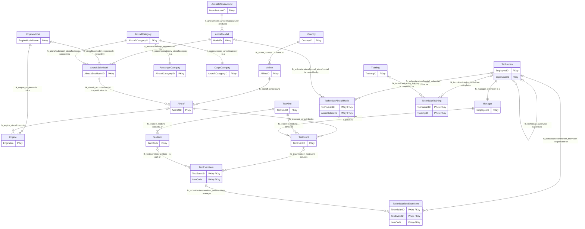

```mermaid

erDiagram
    Country {
        CountryID PKey
    }
    Airline {
        AirlineID PKey
    }
    AircraftManufacturer {
        ManufacturerID PKey
    }
    AircraftModel {
        ModelID PKey
    }
    AircraftSubModel {
        AircraftSubModelID PKey
    }
    EngineModel {
        EngineModelName PKey
    }
    Engine {
        EngineNo PKey
    }
    Aircraft {
        AircraftID PKey
    }
    AircraftCategory {
        AircraftCategoryID PKey
    }
    PassengerCategory {
        AircraftCategoryID PKey
    }
    CargoCategory {
        AircraftCategoryID PKey
    }
    Technician {
        EmployeeID PKey
        SupervisorID FKey
    }
    Manager {
        EmployeeID PKey
    }
    Training {
        TrainingID PKey
    }
    TestKind {
        TestKindID PKey
    }
    TestItem {
        ItemCode PKey
    }
    TestEvent {
        TestEventID PKey
    }
    TechnicianAircraftModel {
        TechnicianID PKey-FKey
        AircraftModelID PKey-FKey
    }
    TechnicianTraining {
        TechnicianID PKey-FKey
        TrainingID PKey-FKey
    }
    TestEventItem {
        TestEventID PKey-FKey
        ItemCode PKey-FKey
    }
    TechnicianTestEventItem {
        TechnicianID PKey-FKey
        TestEventID PKey-FKey
        ItemCode PKey-FKey
    }

    Country ||--o{ Airline : "fk_airline_country    is home to"
    Airline ||--o{ Aircraft : "fk_aircraft_airline    owns"
    AircraftManufacturer ||--|{ AircraftModel : "fk_aircraftmodel_aircraftmanufacturer    produces"
    AircraftModel ||--|{ AircraftSubModel : "fk_aircraftsubmodel_aircraftmodel    has"
    AircraftSubModel ||--o{ Aircraft : "fk_aircraft_aircraftsubmodel    is specification for"
    EngineModel |o--|{ AircraftSubModel : "fk_aircraftsubmodel_enginemodel    is used by"
    EngineModel ||--o{ Engine : "fk_engine_enginemodel    builds"
    Aircraft |o--o{ Engine : "fk_engine_aircraft    mounts"
    AircraftCategory ||--|{ AircraftSubModel : "fk_aircraftsubmodel_aircraftcategory    categorizes"
    
    Technician |o--o{ Technician : "fk_technician_supervisor    supervises"
    TestKind ||--|{ TestItem : "fk_testitem_testkind    consists_of"
    Aircraft ||--o{ TestEvent : "fk_testevent_aircraft    books"
    TestKind ||--o{ TestEvent : "fk_testevent_testkind    conducts"
    Manager ||--o{ TestEvent : "fk_testevent_manager    supervises"

    Technician |o--o{ TechnicianAircraftModel : "fk_technicianaircraftmodel_technician    trains for"
    AircraftModel |o--o{ TechnicianAircraftModel : "fk_technicianaircraftmodel_aircraftmodel    is trained for by"
    Technician |o--o{ TechnicianTraining : "fk_techniciantraining_technician    completes"
    Training |o--o{ TechnicianTraining : "fk_techniciantraining_training    is completed by"
    TestEvent |o--o{ TestEventItem : "fk_testeventitem_testevent    includes"
    TestItem |o--o{ TestEventItem : "fk_testeventitem_testitem    is part of"
    Technician |o--o{ TechnicianTestEventItem : "fk_techniciantesteventitem_technician    responsible for"
    TestEventItem |o--o{ TechnicianTestEventItem : "fk_techniciantesteventitem_testeventitem    manages"

    AircraftCategory ||--|| PassengerCategory : "fk_passengercategory_aircraftcategory    is a"
    AircraftCategory ||--|| CargoCategory : "fk_cargocategory_aircraftcategory    is a"
    Technician ||--|| Manager : "fk_manager_technician    is a"
```

