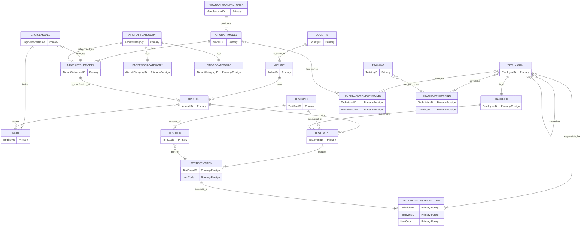

```mermaid

erDiagram
    COUNTRY {
        CountryID Primary
    }
    AIRLINE {
        AirlineID Primary
    }
    AIRCRAFTMANUFACTURER {
        ManufacturerID Primary
    }
    AIRCRAFTMODEL {
        ModelID Primary
    }
    AIRCRAFTSUBMODEL {
        AircraftSubModelID Primary
    }
    ENGINEMODEL {
        EngineModelName Primary
    }
    ENGINE {
        EngineNo Primary
    }
    AIRCRAFT {
        AircraftID Primary
    }
    AIRCRAFTCATEGORY {
        AircraftCategoryID Primary
    }
    PASSENGERCATEGORY {
        AircraftCategoryID Primary-Foreign
    }
    CARGOCATEGORY {
        AircraftCategoryID Primary-Foreign
    }
    TECHNICIAN {
        EmployeeID Primary
    }
    MANAGER {
        EmployeeID Primary-Foreign
    }
    TRAINING {
        TrainingID Primary
    }
    TESTKIND {
        TestKindID Primary
    }
    TESTITEM {
        ItemCode Primary
    }
    TESTEVENT {
        TestEventID Primary
    }
    TECHNICIANAIRCRAFTMODEL {
        TechnicianID Primary-Foreign
        AircraftModelID Primary-Foreign
    }
    TECHNICIANTRAINING {
        TechnicianID Primary-Foreign
        TrainingID Primary-Foreign
    }
    TESTEVENTITEM {
        TestEventID Primary-Foreign
        ItemCode Primary-Foreign
    }
    TECHNICIANTESTEVENTITEM {
        TechnicianID Primary-Foreign
        TestEventID Primary-Foreign
        ItemCode Primary-Foreign
    }

    COUNTRY ||--o{ AIRLINE : is_home_to
    AIRLINE ||--o{ AIRCRAFT : owns
    AIRCRAFTMANUFACTURER ||--|{ AIRCRAFTMODEL : produces
    AIRCRAFTMODEL ||--|{ AIRCRAFTSUBMODEL : has
    AIRCRAFTSUBMODEL ||--|{ AIRCRAFT : is_specification_for
    ENGINEMODEL }o--|| AIRCRAFTSUBMODEL : used_by
    ENGINEMODEL ||--o{ ENGINE : builds
    AIRCRAFT }o--o{ ENGINE : mounts
    AIRCRAFTCATEGORY ||--|{ AIRCRAFTSUBMODEL : categorized_as
    AIRCRAFTCATEGORY ||--|| PASSENGERCATEGORY : is_a
    AIRCRAFTCATEGORY ||--|| CARGOCATEGORY : is_a
    TECHNICIAN }o--o{ TECHNICIAN : supervises
    TECHNICIAN ||--|| MANAGER : is_a
    TESTKIND ||--|{ TESTITEM : consists_of
    AIRCRAFT ||--o{ TESTEVENT : books
    TESTKIND ||--o{ TESTEVENT : conducted_by
    MANAGER ||--o{ TESTEVENT : supervises

    TECHNICIAN }o--|{ TECHNICIANAIRCRAFTMODEL : trains_for
    AIRCRAFTMODEL }o--|{ TECHNICIANAIRCRAFTMODEL : has_trainee
    TECHNICIAN }o--|{ TECHNICIANTRAINING : completes
    TRAINING }o--|{ TECHNICIANTRAINING : has_participant
    TESTEVENT ||--|{ TESTEVENTITEM : includes
    TESTITEM }o--|{ TESTEVENTITEM : part_of
    TECHNICIAN }o--|{ TECHNICIANTESTEVENTITEM : responsible_for
    TESTEVENTITEM ||--|{ TECHNICIANTESTEVENTITEM : assigned_to
```

